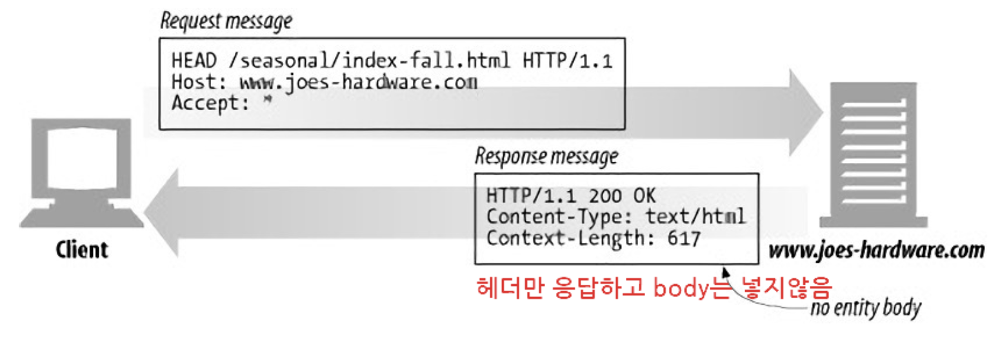
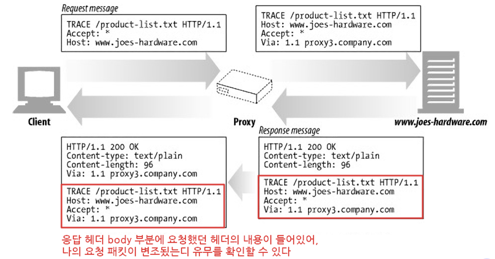
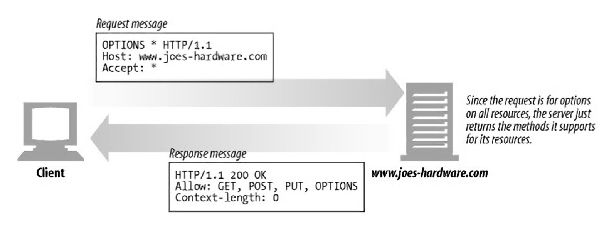
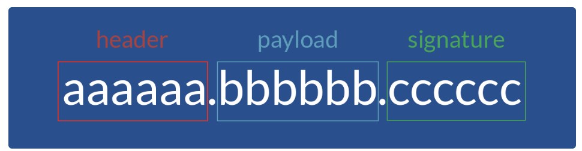

# HTTP status code

---

상태 코드는 3자리 숫자로 만들어져 있으며, 첫번째 자리는 1에서 5까지 제공된다.
**첫번째 자리가 4와 5**인 경우는 정상적인 상황이 아니기 때문에 **사이트 관리자가 즉시 알아야 하는 정보**입니다.
<br>

-   10x : 정보 확인 → 요청을 받았으며 프로세스를 계속 진행
-   20x : 통신 성공 → 요청을 성공적으로 받았고, 인식했고, 수용했음
-   30x : 리다이렉트 → 요청 완료를 위해 추가 작업 조치가 필요
-   **40x : 클라이언트 오류 → 요청의 문법이 잘못되었거나, 요청을 처리할 수 없음**
-   **50x : 서버 오류 → 서버가 명백히 유효한 요청에 대한 충족을 실패**

<br>
<br>

### 100번대 : 정보 확인

| 상태코드 | 이름               | 의미                             |
| -------- | ------------------ | -------------------------------- |
| 100      | Continue           | 진행중                           |
| 101      | Switching Protocol | - 클라이언트 → 서버 로 보낸 요청 |

-   헤더에 대한 응답으로 보내짐
-   해당 코드는 Websocket 프로토콜 전환 시에 사용 |
    | 102 | Processing(WebDAV) | - 서버가 요청 수신함
-   아직 제대로된 응답 알려줄 수 없음 |
    <br>

### 200번대 : 통신 성공

| 상태코드 | 이름        | 의미                     |
| -------- | ----------- | ------------------------ |
| 200      | OK          | 요청 성공(GET)           |
| 201      | Create      | 생성 성공(POST)          |
| 202      | Accepted    | 요청 접수O, 리소스 처리X |
| 204      | No Contents | 요청 성공O, 내용 없음    |

<br>

### 300번대 : 리다이렉트

| 상태코드 | 이름             | 의미                          |
| -------- | ---------------- | ----------------------------- |
| 300      | Multiple Choice  | 요청 URI에 여러 리소스가 존재 |
| 301      | Move Permanently | 요청 URI가 새 위치로 옮겨감   |
| 304      | Not Modified     | 요청 URI의 내용이 변경X       |

<br>

### 400번대 : 클라이언트 오류

| 상태코드 | 이름               | 의미                              |
| -------- | ------------------ | --------------------------------- |
| 400      | Bad Request        | API에서 정의되지 않은 요청 들어옴 |
| 401      | Unauthorized       | 인증 오류                         |
| 403      | Forbidden          | 권한 밖의 접근 시도               |
| 404      | Not Found          | 요청 URI에 대한 리소스 존재X      |
| 405      | Method Not Allowed | API에서 정의되지 않은 메소드 호출 |
| 406      | Not Acceptable     | 처리 불가                         |
| 408      | Request Timeout    | 요청 대기 시간 초과               |
| 409      | Conflict           | 모순                              |
| 429      | Too Many Request   | 요청 횟수 상한 초과               |

<br>

### 500번대 : 서버 오류

| 상태코드 | 이름                  | 의미                 |
| -------- | --------------------- | -------------------- |
| 500      | Internal Server Error | 서버 내부 오류       |
| 502      | Bad Gateway           | 게이트웨이 오류      |
| 503      | Service Unavailable   | 서비스 이용 불가     |
| 504      | Gateway Timeout       | 게이트웨이 시간 초과 |

<br>
<br>
<br>
<br>

# HTTP Request Methods

---

HTTP 메서드란 클라이언트와 서버 사이에 이루어지는 요청(Request)과 응답(Response) 데이터를 전송하는 방식을 일컫는다.
쉽게 말하면 서버에 주어진 리소스에 수행하길 원하는 행동, **서버가 수행해야 할 동작을 지정**하는 요청을 보내는 방법이다.
<br>
<br>

## 1. 주요 메소드

---

**GET / POST / PUT / PATCH / DELETE**
<br>

### 1. GET

리소스를 조회하기 위해 서버에 요청하는 메소드
<br>

### 2. POST

서버로 리소스를 전송하기 위해 사용하는 메소드
Request 데이터를 HTTP Body에 담아 웹 서버로 전송
<br>

### 3. PUT

서버의 리소스를 갱신하기 위해 사용하는 메소드
POST 와 유사하나, 기존 데이터를 갱신할 때 사용한다.
해당 리소스가 없으면 새로 생성
<br>

### 4. PATCH

서버의 리소스를 중 **일부분**만 갱신하기 위해 사용하는 메소드
PUT과 유사하나, 모든 데이터를 갱신하는 것이 아닌 리소스의 일부분만 수정할 때 쓰인다.
<br>

### 5. DELETE

서버의 리소스를 삭제하기 위해 사용하는 메소드

-   실제로 클라이언트에서 서버 자원을 삭제하도록 하진 않아 비활성화로 구성한다.
    <br>
    <br>

## 2. 기타메소드

---

**HEAD / OPTIONS / CONNECT / TRACE**
<br>

### 1.HEAD

메세지 헤더 정보를 받기 위함
HEAD는 실제 문서 요청이 아닌 **<문서에 대한 정보 요청>** 이다.
Response 메세지를 받았을 때, Body는 비어있고, Header 정보만 들어있다.

• 응답의 상태 코드만 확인할때와 같이 Resource를 받지 않고 오직 찾기만 원할때 사용 (일종의 검사 용도)


<br>

### 2. TRACE

Request 리소스가 수신되는 경로를 보기 위함
대상 리소스에 대한 경로를 따라 메시지 루프백 테스트를 수행할 때 사용된다.

• 이 메서드도 일종의 검사용

• 서버에 도달 했을 때의 최종 패킷의 요청 패킷 내용을 응답 받을 수 있다.

• 요청의 최종 수신자는 반드시 송신자에게 200(OK) 응답의 내용(Body)로 수신한 메세지를 반송해야 한다.

• 최초 Client의 요청에는 Body가 포함될수 없다.

<aside>
💡 Tip!
클라이언트의 요청 패킷이 방화벽, Proxy 서버, Gateway 등을 거치면서 패킷의 변조가 일어날 수 있는데, 그래서 TRACE 메서드를 통해 요청했던 패킷 내용과 응답 받은 요청 패킷 내용을 비교하여 변조 유무를 확인 할 수 있다

</aside>


<br>

### 4. OPTIONS

웹 서버 측에서 지원하고 있는 메소드가 무엇인지 알기 위해 사용한다. \**\*\*대상 리소스에 대한 통신 가능 옵션(메서드)을 설명(주로 *CORS에서 사용)

\*CORS(Cross-Origin Resource Sharing)는 출처가 다른 자원들을 공유한다는 뜻으로, 한 출처에 있는 자원에서 다른 출처에 있는 자원에 접근하도록 하는 개념

• 예비 요청(Preflight)에 사용되는 HTTP 메소드

• 예비 요청이란 본 요청을 하기 전에 안전한지 미리 검사하는 것이라고 보면 된다

• 서버의 지원 가능한 HTTP 메서드와 출처를 응답 받아 **[CORS 정책Visit Website](https://inpa.tistory.com/entry/WEB-%F0%9F%93%9A-CORS-%F0%9F%92%AF-%EC%A0%95%EB%A6%AC-%ED%95%B4%EA%B2%B0-%EB%B0%A9%EB%B2%95-%F0%9F%91%8F)**을 검사하기 위한 요청이다.


<br>

### 5. CONNECT

클라이언트와 서버 사이의 중간 경유를 위해 대상 자원으로 식별되는 서버에 대한 터널을 설정
보통 Proxy를 통해 \*SSL 통신을 하고자할 때 사용한다.

-   SSL : 암호화 기반의 통신 프로토콜이다. HTTPS는 HTTP에 SSL이 결합된 개념
    <br>
    <br>
    <br>
    <br>

# 클라이언트의 상태를 기억하는 방법

---

1. 쿠키(cookie) → **브라우저단**에서 클라이언트 정보를 저장 (브라우저에 저장되기 때문에 보안상 취약)
2. 세션(session) → **서버단**에서 클라이언트 정보 저장 (동접속자 많을 경우 서버 과부하 발생)
3. 토큰(OAuth, JWT) → 클라이언트단에서 클라이언트 정보 저장 (보호할 데이터를 토큰으로 치환하여 원본 데이터 대신 토큰을 사용)
   <br>
   <br>
   <br>

# JWT (JSON Web Token)

---

JWT 는 JSON Web Token 의 약자로 전자 서명된 URL-safe(URL로 이용할 수있는 문자 만 구성된)의 JSON 이다.
<br>
<br>

## 구성요소

---

JWT는 `.` 을 구분자로 3가지의 문자열로 구성되어 있다.


<br>
<br>

### 1. 헤더(header)

헤더는 typ 와 alg 두 가지의 정보를 가지고 있다.

-   typ : 토큰의 타입
-   alg : 해싱 알고리즘(HMAC, SHA256 또는 RSA와 같은 해시 알고리즘)

```json
{
    "typ": "JWT",
    "alg": "HS256"
}
```

<br>

### 2. 정보(payload)

Payload 부분에는 토큰을 담을 정보가 들어가 있다.

-   정보의 한 조각을 클레임(claim)이라고 부르고, 이는 **name / value** 의 한 쌍으로 이뤄져있다.
-   토큰에는 여러개의 클레임들을 넣을 수 있지만 너무 많아질경우 토큰의 길이가 길어질 수 있다.

<br>

### 3. 서명(signature)

Signature는 secret key를 포함하여 암호화되어 있다.

-   서명은 헤더의 인코딩값과 정보의 인코딩값을 합친후 주어진 비밀키로 해쉬를 하여 생성한다.
    이렇게 만든 해쉬를 `base64`형태로 나타내게 된다.
    <br>

## JWT Process

---


<br>

1. 서버는 요청을 확인하고 secret key를 통해 Access token을 발급
2. JWT 토큰을 클라이언트에 전달
3. 클라이언트에서 API 을 요청할때 클라이언트가 Authorization header에 Access token을 담아서 보냄
4. 서버는 JWT Signature를 체크하고 Payload로부터 사용자 정보를 확인해 데이터를 반환
5. 클라이언트의 로그인 정보를 서버 메모리에 저장하지 않기 때문에 토큰기반 인증 메커니즘을 제공
6. 인증이 필요한 경로에 접근할 때 서버 측은 Authorization 헤더에 유효한 JWT 또는 존재하는지 확인
   <br>

## JWT 특징

---

⇒ 서버로부터 독립적이라 할 수 있으며, **서버의 부담을 덜어줄 수 있다.**
<br>

-   JWT 는 그 자체가 암호화 된 문자열 데이터이다.
-   JWT 는 자체적으로 정보를 갖고 있는 토큰이기 때문에 서버에 저장될 필요가 없다.
-   토큰은 HTTP header에 추가되기 때문에 서버에 따로 보관할 필요가 없으므로 서버에 부하를 일으키지 않는다.
-   토큰을 생성할 때 암호화 과정을 거치므로 보안적으로 안전하다. - 그래도 짧은 시간의 유효시간을 두는 것을 권장한다.
    <br>
    <br>
    <br>

출처 및 참고

https://www.whatap.io/ko/blog/40/

[https://inpa.tistory.com/entry/WEB-🌐-HTTP-메서드-종류-통신-과정-💯-총정리#http*method*종류](https://inpa.tistory.com/entry/WEB-%F0%9F%8C%90-HTTP-%EB%A9%94%EC%84%9C%EB%93%9C-%EC%A2%85%EB%A5%98-%ED%86%B5%EC%8B%A0-%EA%B3%BC%EC%A0%95-%F0%9F%92%AF-%EC%B4%9D%EC%A0%95%EB%A6%AC#http_method_%EC%A2%85%EB%A5%98)

http://www.opennaru.com/opennaru-blog/jwt-json-web-token/

https://victorydntmd.tistory.com/286
